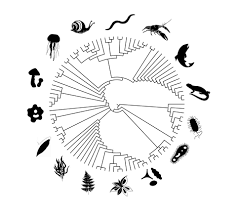

```{r setup, include=FALSE}
knitr::opts_chunk$set(echo = TRUE)
```


# Lab Files

## [Lab 1](labs/lab1_SM.html)

## [Lab 2](labs/lab2.html)

## [Lab 3a](labs/Lab3A.html)

## [Lab 3b](labs/Lab3B.html)

## [Lab 4](labs/lab4.html)

## [Lab 4a - ggplot](labs/lab4_ggplot2.html)

## [Lab 5](labs/lab5.html)

## [Lab 5x](labs/lab5x.html)

## [Lab 6](labs/lab6.html)

## [Lab 6x - Shiny](labs/lab6x.html)

## [Lab 8](labs/lab8.html)