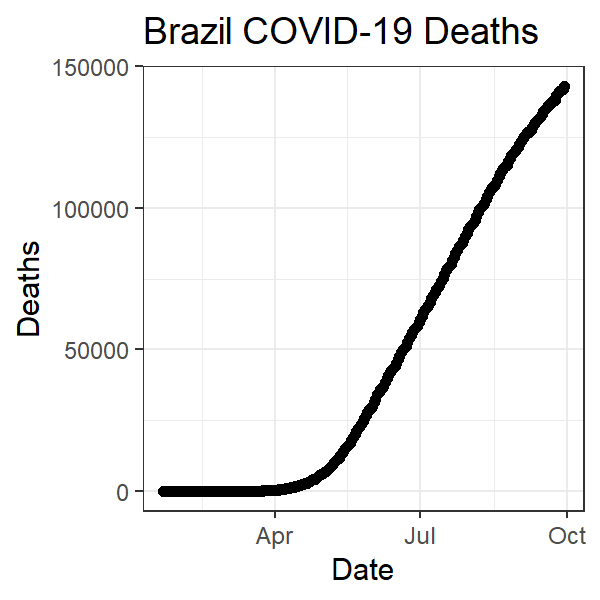

```{r setup, include=FALSE}
knitr::opts_chunk$set(echo = TRUE)
```

```{r, include=FALSE}
library(tidyverse)
library(lubridate)
library(plotly)

```

```{r, warning=FALSE, error=FALSE, echo=FALSE, message=FALSE}
time_series_confirmed_long <- read_csv(url("https://raw.githubusercontent.com/CSSEGISandData/COVID-19/master/csse_covid_19_data/csse_covid_19_time_series/time_series_covid19_confirmed_global.csv")) %>%
  rename(Province_State = "Province/State", Country_Region = "Country/Region")  %>% 
               pivot_longer(-c(Province_State, Country_Region, Lat, Long),
                             names_to = "Date", values_to = "Confirmed") 
# Let's get the times series data for deaths
time_series_deaths_long <- read_csv(url("https://raw.githubusercontent.com/CSSEGISandData/COVID-19/master/csse_covid_19_data/csse_covid_19_time_series/time_series_covid19_deaths_global.csv")) %>%
  rename(Province_State = "Province/State", Country_Region = "Country/Region")  %>% 
  pivot_longer(-c(Province_State, Country_Region, Lat, Long),
               names_to = "Date", values_to = "Deaths")
# Create Keys 
time_series_confirmed_long <- time_series_confirmed_long %>% 
  unite(Key, Province_State, Country_Region, Date, sep = ".", remove = FALSE)
time_series_deaths_long <- time_series_deaths_long %>% 
  unite(Key, Province_State, Country_Region, Date, sep = ".") %>% 
  select(Key, Deaths)
# Join tables
time_series_long_joined <- full_join(time_series_confirmed_long,
    time_series_deaths_long, by = c("Key")) %>% 
    select(-Key)
# Reformat the data
time_series_long_joined$Date <- mdy(time_series_long_joined$Date)
# Create Report table with counts
time_series_long_joined_counts <- time_series_long_joined %>% 
  pivot_longer(-c(Province_State, Country_Region, Lat, Long, Date),
               names_to = "Report_Type", values_to = "Counts")
```

## Interactive Graph example
```{r}
ggplotly(
  time_series_long_joined %>% 
    group_by(Country_Region,Date) %>% 
    summarise_at(c("Confirmed", "Deaths"), sum) %>% 
    filter (Country_Region == "US") %>% 
    ggplot(aes(x = Date,  y = Deaths)) + 
      geom_point() +
      geom_line() +
      ggtitle("US COVID-19 Deaths")
 )
```

## Animated Graph example
```{r}
library(gganimate)
library(transformr)
library(gifski)
theme_set(theme_bw())

data_time <- time_series_long_joined %>% 
    group_by(Country_Region,Date) %>% 
    summarise_at(c("Confirmed", "Deaths"), sum) %>% 
    filter (Country_Region %in% c("China","Korea, South","Japan","Italy","US")) 
p <- ggplot(data_time, aes(x = Date,  y = Confirmed, color = Country_Region)) + 
      geom_point() +
      geom_line() +
      ggtitle("Confirmed COVID-19 Cases") +
      geom_point(aes(group = seq_along(Date))) +
      transition_reveal(Date) 
# Some people needed to use this line instead
# animate(p,renderer = gifski_renderer(), end_pause = 15)
animate(p, end_pause = 15)
#
```
## Challenge 1
### Print a graph (different from the one above) to a png file using 3*ppi for the height and width and display the png file in the report using the above R Markdown format.

```{r}
#Convert to PNG
ppi <- 300
png("images/time_series_example_plot.png", width=3*ppi, height=3*ppi, res=ppi)
time_series_long_joined %>% 
  group_by(Country_Region,Date) %>% 
  summarise_at(c("Confirmed", "Deaths"), sum) %>% 
  filter (Country_Region == "Brazil") %>% 
    ggplot(aes(x = Date,  y = Deaths)) + 
    geom_point() +
    geom_line() #+ ggtitle("Brazil COVID-19 Deaths")
```

 

## Challenge 2
### Turn one of the exercises from Lab 5 into an interactive graph with plotyly
```{r, warning=FALSE, error=FALSE, message=FALSE}
time_series_long_joined_ratio <- time_series_long_joined %>% 
  group_by(Country_Region, Date) %>% 
  summarise(Total_Confirmed = sum(Confirmed), Total_Deaths = sum(Deaths)) %>%
  mutate(Ratio = Total_Deaths / Total_Confirmed)

time_series_long_total_deaths <- time_series_long_joined_ratio %>%
  group_by(Country_Region) %>%
  summarise(Deaths = sum(Total_Deaths)) %>%
  arrange(desc(Deaths)) %>%
  slice(1:10)

g <- time_series_long_joined_ratio %>% 
    filter(Country_Region %in% c("US", "Brazil", "United Kingdom", "Italy", "Mexico", "France", "Spain", "India", "Iran", "Peru")) %>% 
    ggplot(aes(x = Date,  y = Total_Deaths, fill = Country_Region, color = Country_Region)) + 
    geom_point() +
    geom_line() +
    ggtitle("The Top 10 Countries by Total Deaths") +
    transition_reveal(Date) 

animate(g,renderer = gifski_renderer(), end_pause = 15)
```

## Challenge 3
### Create an animated graph of your choosing using the time series data to display an aspect (e.g. states or countries) of the data that is important to you.

```{r}

```

