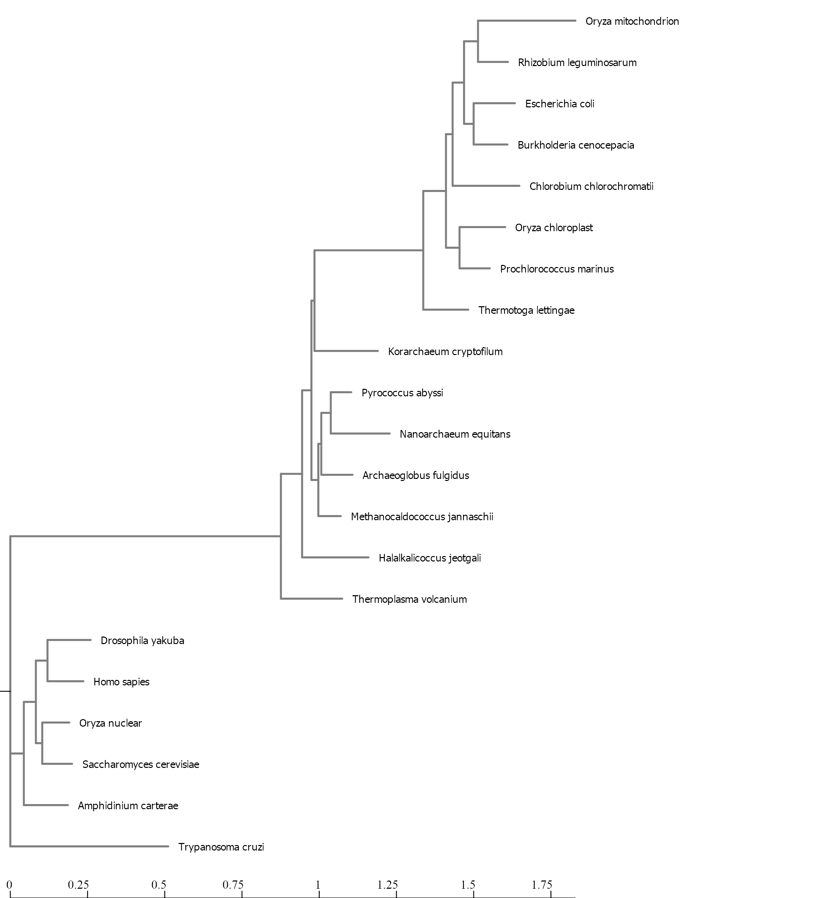

```{r setup, include=FALSE}
knitr::opts_chunk$set(echo = TRUE)
```

## Use NGPhylogeny.fr to analyse the set of rRNA sequences provided.
1. Log into CIPRES and create a new folder for your data.
2. Upload the Tree_of_Life_Cores_sequences.fna file.
3. Create and run a task, using the data, with MAFFT.
4. Save the output in the folder with your original data.
5. Create and run a task, using the MAFFT output data, with FasttreeMP.
6. Save the output in the folder with your original data.
7. Open the data folder and download the .tre data for graphing.
8. Download and display the .svg tree from FasttreeMP (converted to png, below).
9. Use the FasttreeMP data in R to [create and label a tree graph.](lab8.html)



# ggtree Tutorial
Load in the libraries.
```{r, message=FALSE}
library(tidyverse)
library(ggtree)
library(treeio)
library(ggimage)
```

Download the example tree and read it's contents.
```{r}
tree <- read.tree("data/tree_newick.nwk")
tree
```

## Exercise 1
Create a slanted phylogenetic tree.
```{r}
#?ggtree
ggtree(tree, layout = "slanted")
```

Create a circular phylogenetic tree.
```{r}
ggtree(tree, layout = "circular")
```

Create a circular, unscaled cladogram with thick red lines.
```{r}
ggtree(tree, layout = "circular", branch.length="none", color="red", size=2)
```

## Exercise 2
Create a phylogeny with the following aesthetic characteristics:
-tips labeled in purple
-purple-colored diamond-shape tip points (hint: Google search “R point characters”)
-large semitransparent yellow node points (hint: alpha=)
-Add a title with + ggtitle(...)
```{r}
p <- ggtree(tree)
p + geom_tippoint(color = "purple", pch = 18) + geom_tiplab(color = "purple") + geom_nodepoint(color="yellow", size=6, alpha = 0.5) + ggtitle("Exercise 2 Figure: Not the prettiest phylogenetic aesthetics, but it'll do.")
```

## Exercise 3
1. First, find what the MRCA is for taxa B+C, and taxa L+J.
```{r}
MRCA(tree, c("B", "C"))
MRCA(tree, c("L", "J"))
```

2. Draw the tree with ggtree(tree).
3. Add tip labels.
4. Highlight these clades with separate colors.
5. Add a clade label to the larger superclade (node=17) that we saw before that includes A, B, C, D, and E.
6. Link taxa C to E, and G to J with a dashed gray line. 
7. Add a scale bar to the bottom by changing the theme.
```{r}
ggtree(tree) + 
  geom_tiplab() + 
  geom_hilight(node=19, fill="purple") + 
  geom_hilight(node=23, fill="gold") +
  geom_cladelabel(node=17, label="Superclade 17", color="red2", offset= -7, align=TRUE) + 
  geom_taxalink("C", "E", color = "grey", linetype = 2) +
  geom_taxalink("G", "J", color = "grey", linetype = 2) +
  theme_tree2() +
  ggtitle("Exercise 3 title: Not sure what we're trying to show here...")
```

8. Make it a circle? 
```{r}
ggtree(tree, layout = "circular") + 
  geom_tiplab() + 
  geom_hilight(node=19, fill="purple") + 
  geom_hilight(node=23, fill="gold") +
  geom_cladelabel(node=17, label="Superclade 17", color="red2", offset= -7, align=TRUE) + 
  geom_taxalink("C", "E", color = "grey", linetype = 2) +
  geom_taxalink("G", "J", color = "grey", linetype = 2) +
  theme_tree2() +
  ggtitle("Exercise 3 title: Not sure what we're trying to show here...")
```

## Make a tree for the FastTreeMP output on CIPRES
Use ggtree to make the tree images, coloring the tree according to the domains of life.
```{r}
my_tree <- read.tree("data/fastree_result.tre")

ggtree(my_tree, branch.length="none", layout = "circular") +
  xlim(0,21) +
  geom_tiplab(hjust=-.1, size = 3) +
  geom_hilight(node=22, fill="green", extend = 0.5) +
  geom_hilight(node=34, fill="gold", extend = 0.5) +
  geom_hilight(node=29, fill="purple", extend = 0.5)
```
